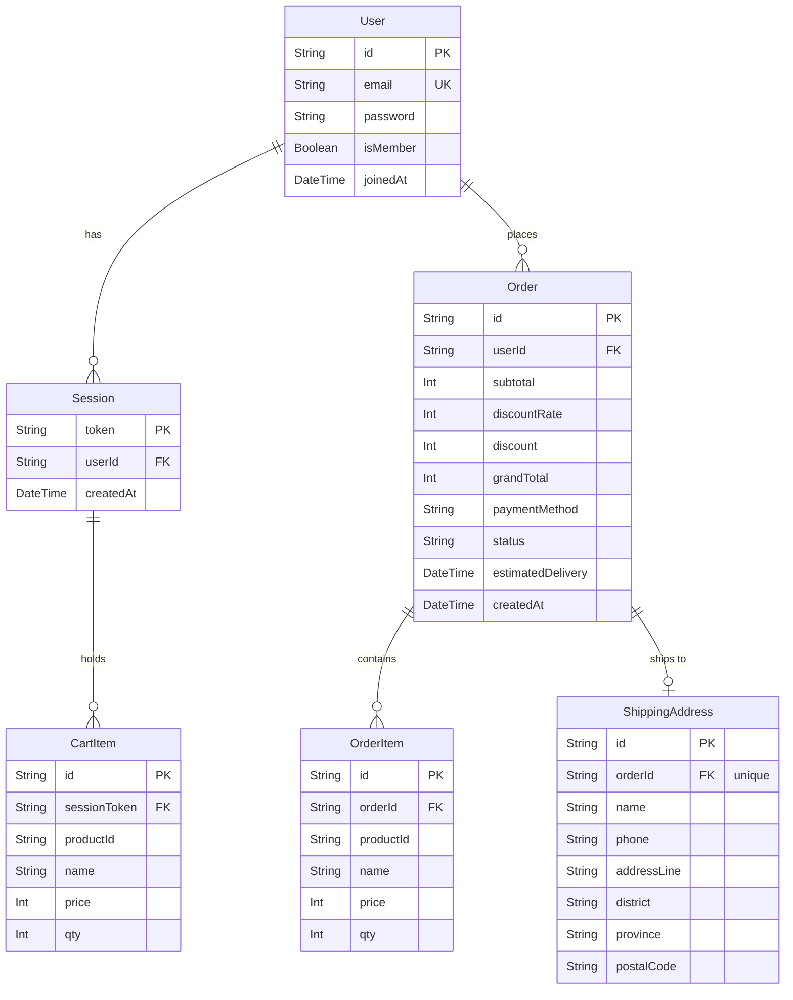

# ER Diagram — Grocery App

```mermaid
erDiagram
    User {
        String  id         PK
        String  email      UK
        String  password
        Boolean isMember
        DateTime joinedAt
    }

    Session {
        String   token     PK
        String   userId    FK
        DateTime createdAt
    }

    CartItem {
        String id           PK
        String sessionToken FK
        String productId
        String name
        Int    price
        Int    qty
    }

    Order {
        String   id                PK
        String   userId            FK
        Int      subtotal
        Int      discountRate
        Int      discount
        Int      grandTotal
        String   paymentMethod
        String   status
        DateTime estimatedDelivery
        DateTime createdAt
    }

    OrderItem {
        String id        PK
        String orderId   FK
        String productId
        String name
        Int    price
        Int    qty
    }

    ShippingAddress {
        String id          PK
        String orderId     FK "unique"
        String name
        String phone
        String addressLine
        String district
        String province
        String postalCode
    }

    User       ||--o{ Session         : "has"
    User       ||--o{ Order           : "places"
    Session    ||--o{ CartItem        : "holds"
    Order      ||--o{ OrderItem       : "contains"
    Order      ||--o| ShippingAddress : "ships to"
```
